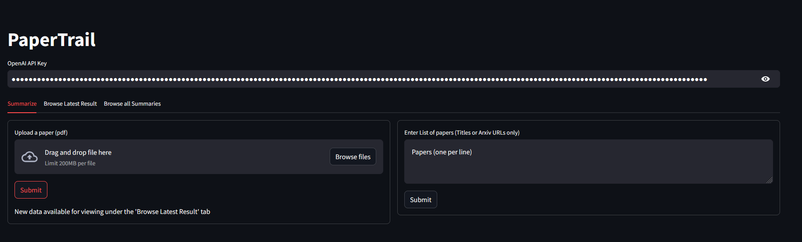
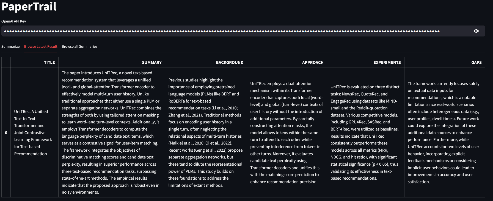

# Paper Trail

An LLM (OpenAI gpt-4o-mini) based research paper summarizer. Local application, saves data in local file system.

## Basic Features
- Upload a paper to generate summaries and insights
- Provide paper titles or Arxiv URLs to bulk download and summarize
- Browse previously generated summaries

## Usage
1. Bring up the app using `streamlit run app.py`
2. Provide a valid OpenAI API key in the text field once the UI is up in the browser
3. Upload a paper or Provide paper titles/URLs (one per line). Click Submit
4. The results of the latest analysis (single paper/bulk papers) will be available as a table in the `Browse Latest Result` tab
5. All summaries will appear in the `Browse all Summaries` tab

## Additional Info
1. Arxiv API has a 3 second rate limit. Muliple papers will take a while to download
2. Analysis is subject to OpenAI response times
3. The pdfs summaries and analyses are stored locally
4. By default, the PDFs are in the `pdfs/` folder and summaries in the `exports/` folder as csvs
5. References are removed from the paper using a very basic search to avoid overflowing LLM context window
6. Ollama interface is available in the code, but there are issues with some models, so I have not integrated it with the UI

# Screenshots

-- utkd
